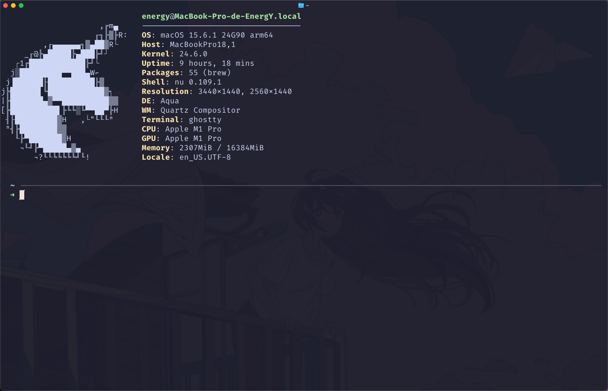
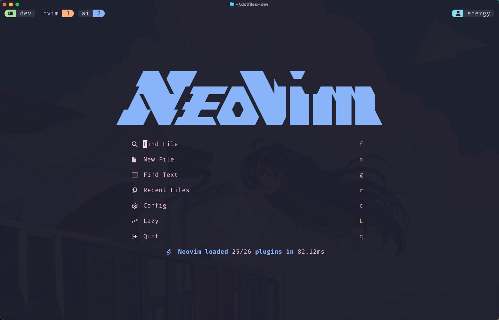

<div align="center">
  

*My personal development environment configuration*

[](https://www.apple.com/macos) [](https://neovim.io/) [](https://www.nushell.sh/) [](https://github.com/catppuccin/catppuccin)

</div>

## ✨ Overview

A carefully curated collection of configuration files for a modern, efficient, and beautiful terminal development environment. Optimized for macOS with a focus on productivity and aesthetics.

## 📦 What's Inside

### 🎨 Terminal & Shell

<div align="center">
  
</div>

- **[Ghostty](https://ghostty.org/)** - Modern GPU-accelerated terminal emulator
  - Catppuccin Mocha theme
  - Custom cursor shader effects
  - FiraCode Nerd Font with MonoLisa italic variant
  - Optimized transparency and blur settings

- **[Nushell](https://www.nushell.sh/)** - Modern shell with structured data pipelines
  - Starship prompt integration
  - Carapace completions
  - Custom aliases and development functions
  - Automatic Neofetch startup with custom ASCII art

### ⚡ Development Tools

<div align="center">
  
</div>

- **[Neovim](https://neovim.io/)** - Hyperextensible Vim-based text editor
  - 16+ carefully selected plugins
  - LSP configuration with TypeScript support
  - GitHub Copilot integration (`:Copilot setup` to configure)
  - Catppuccin theme
  - Noice UI enhancements
  - Blink completion
  - LazyDocker & LazySQL integrations
  - Wakatime tracking (requires `brew install wakatime-cli`, then `:WakaTimeApiKey` to setup, view at [wakatime.com/dashboard](https://wakatime.com/dashboard))
  - Media streaming integration - Real-time music playback notifications

- **[Tmux](https://github.com/tmux/tmux)** - Terminal multiplexer
  - Catppuccin theme
  - Vim-like pane navigation
  - Custom key bindings (Ctrl+A prefix)
  - Mouse support enabled
  - Tmux-fzf integration

### 🛠️ Code Quality

- **[ESLint](code/eslint/)** - Customizable linting configurations
  - TypeScript support
  - Turborepo compatible
  - Framework-specific configs (React, Vue, Svelte, Nuxt, AdonisJS)
  - Tailwind CSS integration

- **GitHub Actions** - CI/CD workflows

### 🎯 Productivity Aliases

```nu
l   → ls                    # Quick listing
ll  → ls -l                 # Detailed listing
n   → nvim                  # Open Neovim
cat → bat                   # Prettier cat with syntax highlighting
d   → docker                # Docker shortcut
p   → pnpm                  # Package manager
ai  → copilot               # GitHub Copilot CLI (Claude Sonnet 4.5)
mc  → mole clean            # Mole clean command
ms  → mole status           # Mole status command
```

### 🔥 Custom Functions

- **`dev`** - Instantly launch a development environment with tmux sessions for Neovim and AI assistant
- **`s`** - Fuzzy find and open files in Neovim with live preview

## 📋 Prerequisites

Before installing, make sure you have:

- **[Homebrew](https://brew.sh/)** - Package manager for macOS
- **[Nushell](https://www.nushell.sh/)** - Modern shell
- **[Docker Desktop](https://www.docker.com/products/docker-desktop/)** - Container platform

## 🚀 Quick Start

**Clone the repository**

```bash
git clone git@github.com:rEnergYr/dotfiles.git ~/.dotfiles
```

**Symlink configurations**

```bash
# Neovim
ln -s ~/.dotfiles/nvim ~/.config/nvim

# Tmux (Don't forget to clone TPM first!)
ln -s ~/.dotfiles/tmux/tmux.conf ~/.tmux.conf

# Ghostty
ln -s ~/.dotfiles/ghostty/config ~/.config/ghostty/config

# Starship
ln -s ~/.dotfiles/starship/starship.toml ~/.config/starship.toml

# Neofetch
ln -s ~/.dotfiles/neofetch/config.conf  ~/.config/neofetch/config.conf

# Nushell
ln -sf ~/.dotfiles/nushell/config.nu ($env.HOME | path join "Library/Application Support/nushell/config.nu")
ln -sf ~/.dotfiles/nushell/env.nu   ($env.HOME | path join "Library/Application Support/nushell/env.nu")
```

**Install dependencies**

```bash
nu ~/.dotfiles/nushell/install.nu
```

## 📚 Key Technologies

| Tool | Purpose | Configuration |
|------|---------|---------------|
| 👻 **Ghostty** | Terminal Emulator | [`ghostty/config`](ghostty/config) |
| 🐚 **Nushell** | Modern Shell | [`nushell/config.nu`](nushell/config.nu) |
| ✏️ **Neovim** | Text Editor | [`nvim/init.lua`](nvim/init.lua) |
| 🖥️ **Tmux** | Terminal Multiplexer | [`tmux/tmux.conf`](tmux/tmux.conf) |
| 🎨 **Neofetch** | System Info | [`neofetch/ascii.txt`](neofetch/ascii.txt) |
| 🔍 **ESLint** | Linting | [`code/eslint/`](code/eslint/) |

## 🎨 Theme

All configurations use the **Catppuccin Mocha** color scheme for a consistent, beautiful, and comfortable visual experience across all tools.

**Fonts:**

- [`MonoLisa`](https://www.monolisa.dev)
- [`FiraCode`](https://github.com/ryanoasis/nerd-fonts)

<div align="center">
Crafted in Middle-Stack ⚔️
</div>
