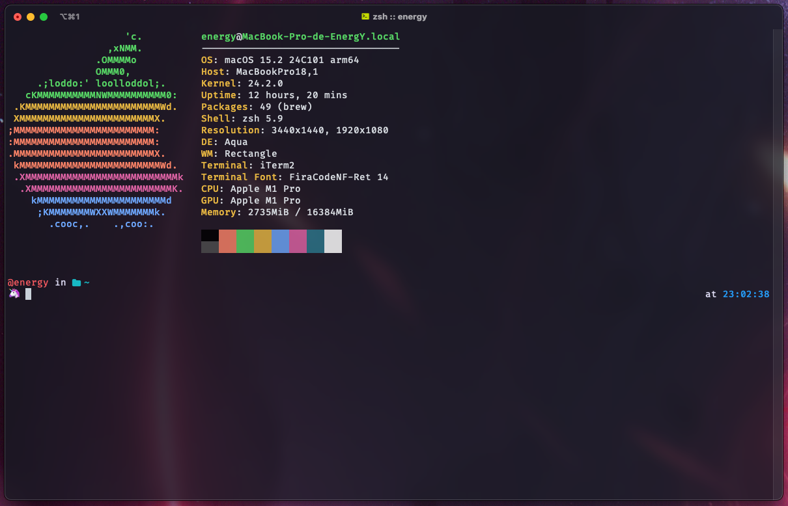
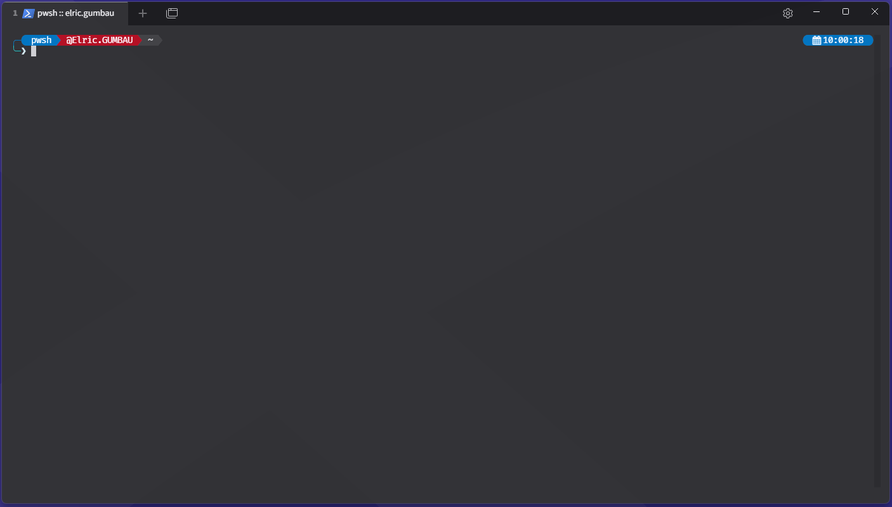
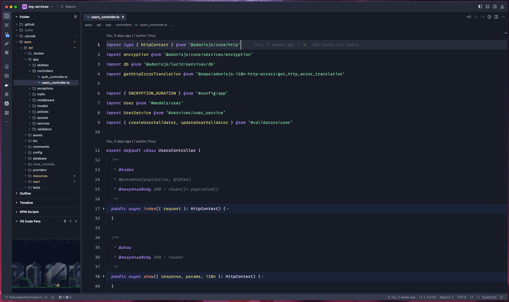

  

## Configuration

- Zsh / Powershell
- ITerm2 / Tabby.sh
- ESLint
- GitHub actions
- Oh My Posh
- Trae.ai

## Iterm2 setup

Requires:

- [`Iterm2`](https://iterm2.com) (v3.5.11)
- [`zsh`](https://www.zsh.org) (v5.8.1) 

Packages:

- [`AstroNvim/AstroNvim`](https://github.com/AstroNvim/AstroNvim) - Aesthetic and feature-rich neovim config that is extensible and easy to use with a great set of plugins
- [`athityakumar/colorls`](https://github.com/athityakumar/colorls) - A Ruby gem that beautifies the terminal's ls command, with color and font-awesome icons
- [`dylanaraps/neofetch`](https://github.com/dylanaraps/neofetch) - A command-line system information tool written in bash 3.2+
- [`Homebrew/brew`](https://github.com/Homebrew/brew) - 🍺 The missing package manager for macOS (or Linux)
- [`httpie/httpie`](https://github.com/httpie/httpie) - HTTPie for Terminal — modern, user-friendly command-line HTTP client
- [`JanDeDobbeleer/oh-my-posh`](https://github.com/JanDeDobbeleer/oh-my-posh) - A prompt theme engine for any shell
- [`junegunn/fzf`](https://github.com/junegunn/fzf) - 🌸 A command-line fuzzy finder
- [`neovim/neovim`](https://github.com/neovim/neovim) - Vim-fork focused on extensibility and usability
- [`ruby/ruby`](https://github.com/ruby/ruby) - The Ruby Programming Language
- [`rust-lang/rust`](https://github.com/rust-lang/rust) - Empowering everyone to build reliable and efficient software
- [`sharkdp/bat`](https://github.com/sharkdp/bat) - A cat(1) clone with wings
- [`withfig/autocomplete`](https://github.com/withfig/autocomplete) - Fig adds autocomplete to your terminal
- [`zsh-users/zsh-syntax-highlighting`](https://github.com/zsh-users/zsh-syntax-highlighting) - Fish shell like syntax highlighting for Zsh
- [`zsh-users/zsh-history-substring-search`](https://github.com/zsh-users/zsh-history-substring-search) - ZSH port of Fish history search

## Tabby.sh setup

Requires:

- [`Tabby.sh`](https://tabby.sh) (v1.0.221)
- [`pwsh`](https://github.com/PowerShell/PowerShell) (v7.2.6)

Packages:

- [`AstroNvim/AstroNvim`](https://github.com/AstroNvim/AstroNvim) - Aesthetic and feature-rich neovim config that is extensible and easy to use with a great set of plugins
- [`devblackops/Terminal-Icons`](https://github.com/devblackops/Terminal-Icons) - A PowerShell module to show file and folder icons in the terminal
- [`JanDeDobbeleer/oh-my-posh`](https://github.com/JanDeDobbeleer/oh-my-posh) - A prompt theme engine for any shell
- [`neovim/neovim`](https://github.com/neovim/neovim) - Vim-fork focused on extensibility and usability
- [`PowerShell/PSReadLine`](https://github.com/PowerShell/PSReadLine) - A bash inspired readline implementation for PowerShell
- [`rs/curlie`](https://github.com/rs/curlie) - The power of curl, the ease of use of httpie
- [`ScoopInstaller/Scoop`](https://github.com/ScoopInstaller/Scoop) - A command-line installer for Windows
- [`sharkdp/bat`](https://github.com/sharkdp/bat) - A cat(1) clone with wings

## Trae.ai setup

Requires:

- [`trae.ai`](https://www.trae.ai) (>= 1.0.1)

Extensions:

- [`AdonisJS Extension`](https://marketplace.visualstudio.com/items?itemName=jripouteau.adonis-vscode-extension) - The official VSCode extension of AdonisJS
- [`Code Spell Checker`](https://marketplace.visualstudio.com/items?itemName=streetsidesoftware.code-spell-checker) - Spelling checker for source code
- [`Docker`](https://marketplace.visualstudio.com/items?itemName=ms-azuretools.vscode-docker) - Makes it easy to create, manage, and debug containerized applications
- [`Edge templates syntax highlighter`](https://marketplace.visualstudio.com/items?itemName=AdonisJS.vscode-edge) - Official Edge template engine extension for VSCode
- [`Error Lens`](https://marketplace.visualstudio.com/items?itemName=usernamehw.errorlens) - Improve highlighting of errors, warnings and other language diagnostics
- [`ESLint`](https://marketplace.visualstudio.com/items?itemName=dbaeumer.vscode-eslint) - Integrates ESLint JavaScript into VS Code
- [`GitHub Actions`](https://marketplace.visualstudio.com/items?itemName=me-dutour-mathieu.vscode-github-actions) - YAML schema validation and auto-completion for GitHub Actions
- [`GitHub Local Actions`](https://marketplace.visualstudio.com/items?itemName=SanjulaGanepola.github-local-actions) - Run your GitHub Actions locally!
- [`GitLens — Git supercharged`](https://marketplace.visualstudio.com/items?itemName=eamodio.gitlens) - Supercharge Git within VS Code
- [`Gitmoji`](https://marketplace.visualstudio.com/items?itemName=seatonjiang.gitmoji-vscode) - Gitmoji tool for git commit messages in VSCode
- [`Javascript Auto Backticks`](https://marketplace.visualstudio.com/items?itemName=chamboug.js-auto-backticks) - Automatically converts single or double quotes to backticks when needed
- [`MySQL`](https://marketplace.visualstudio.com/items?itemName=cweijan.vscode-mysql-client2) - Database Management for MySQL/MariaDB, PostgreSQL, Redis and ElasticSearch
- [`Pretty TypeScript Errors`](https://marketplace.visualstudio.com/items?itemName=yoavbls.pretty-ts-errors) - Make TypeScript errors prettier and more human-readable in VSCode
- [`Svelte for VS Code`](https://marketplace.visualstudio.com/items?itemName=svelte.svelte-vscode) - Svelte language support for VS Code
- [`Tailwind CSS IntelliSense`](https://marketplace.visualstudio.com/items?itemName=bradlc.vscode-tailwindcss) - Intelligent Tailwind CSS tooling for VS Code
- [`Tailwind Fold`](https://marketplace.visualstudio.com/items?itemName=stivo.tailwind-fold) - Improves code readability by folding class attributes
- [`vscode-pets`](https://marketplace.visualstudio.com/items?itemName=tonybaloney.vscode-pets) - Pets for your VS Code
- [`WakaTime`](https://marketplace.visualstudio.com/items?itemName=WakaTime.vscode-wakatime) - Metrics, insights, and time tracking automatically generated from your programming activity.

## Fonts

- [`MonoLisa`](https://www.monolisa.dev) - For code editor.
- [`FiraCode`](https://github.com/ryanoasis/nerd-fonts) - For terminal.
